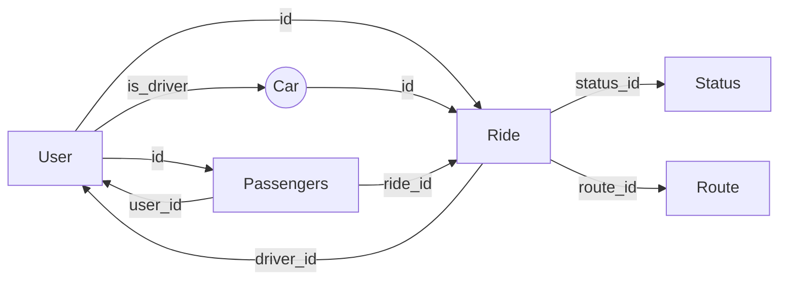
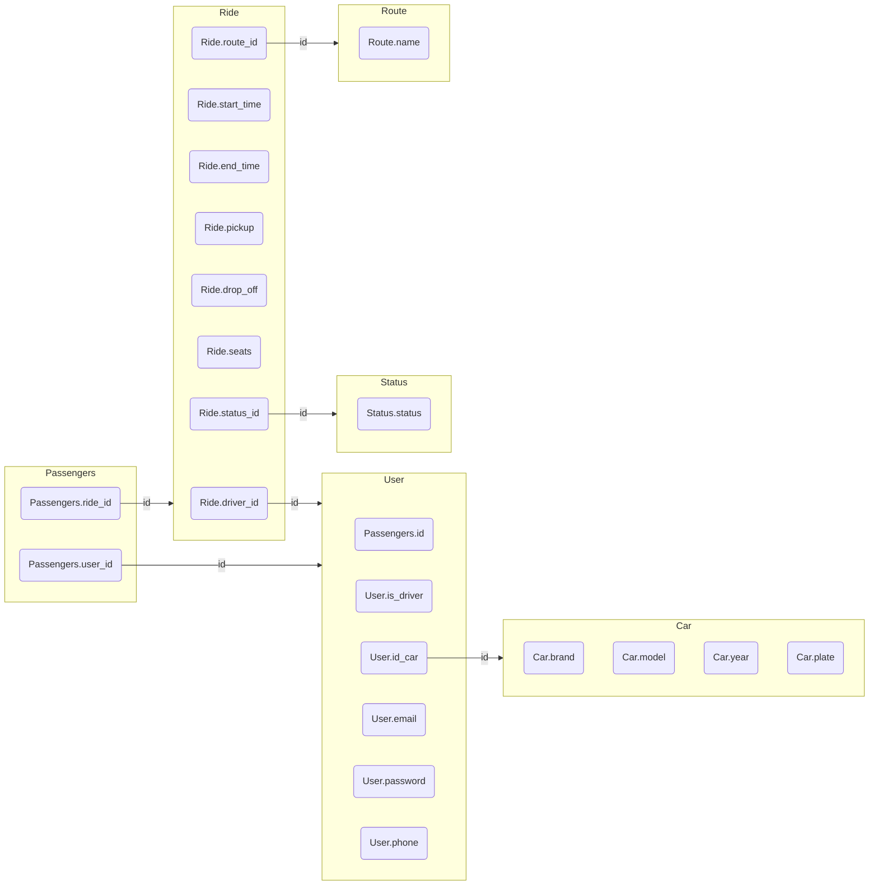

# Database Schema

This documentation provides an overview of the database schema, including the tables and their respective columns, data types, relationships and descriptions.

## User Table

The User table represents individual users of the system. It stores information such as their unique identifier, driver status, associated car (through the foreign key id_car), email address, password, and phone number.

Column | Data Type | Description
--- | --- | ---
id | INT | Unique identifier for a user
is_driver | BOOLEAN | Flag indicating if the user is a driver or not
id_car | INT | Foreign key to the Car table (associated car)
email | VARCHAR(100) | User's email address
password | VARCHAR(100) | User's password
phone | VARCHAR(20) | User's phone number

## Ride Table

The Ride table stores information related to individual rides. It includes attributes such as the unique identifier for the ride, driver ID (foreign key to User table), start time, end time, pickup location, drop-off location, available seats, status ID (foreign key to Status table), and associated route ID (foreign key to Route table).

Column | Data Type | Description
--- | --- | ---
id | INT | Unique identifier for a ride
driver_id | INT | Foreign key to the User table (driver user)
start_time | DATETIME | Start time of the ride
end_time | DATETIME | End time of the ride
pickup | VARCHAR(100) | Pickup location
drop_off | VARCHAR(100) | Drop-off location
seats | INT | Number of available seats in the ride
status_id | INT | Foreign key to the Status table (status of the ride)
route_id | INT | Foreign key to the Route table (associated route)

## Car Table

The Car table holds information about the cars in the system. It includes details such as the unique identifier, brand or manufacturer, model, year, and license plate number of each car.

Column | Data Type | Description
--- | --- | ---
id | INT | Unique identifier for a car
brand | VARCHAR(50) | Brand or manufacturer of the car
model | VARCHAR(50) | Model of the car
year | INT | Year of the car
plate | VARCHAR(20) | License plate number of the car

## Status Table

The Status table represents the different statuses that a ride can have. It includes a unique identifier and a name or description for each status.

Column | Data Type | Description
--- | --- | ---
id | INT | Unique identifier for a status
status | VARCHAR(50) | Name or description of the status

## Route Table

The Route table holds information about the different routes available. It includes a unique identifier and a name or description for each route.

Column | Data Type | Description
--- | --- | ---
id | INT | Unique identifier for a route
name | VARCHAR(100) | Name or description of the route

## Passengers Table

The Passengers table stores information about passengers associated with rides. It includes a unique identifier, user ID (foreign key to User table), and ride ID (foreign key to Ride table).

Column | Data Type | Description
--- | --- | ---
id | INT | Unique identifier for a passenger
user_id | INT | Foreign key to the User table (passenger user)
ride_id | INT | Foreign key to the Ride table (associated ride)

# Relationships

| Table       | Related Table  | Foreign Key   | Relationship Type | Relationship Description                                        |
|-------------|----------------|---------------|-------------------|----------------------------------------------------------------|
| User        | Car            | id_car        | One-to-One        | User has a one-to-one relationship with Car                     |
| User        | Ride           | id            | One-to-Many       | User has a one-to-many relationship with Ride                   |
| User        | Passengers     | id            | One-to-Many       | User has a one-to-many relationship with Passengers             |
| Ride        | User           | driver_id     | Many-to-One       | Ride has a many-to-one relationship with User                   |
| Ride        | Status         | status_id     | Many-to-One       | Ride has a many-to-one relationship with Status                 |
| Ride        | Route          | route_id      | Many-to-One       | Ride has a many-to-one relationship with Route                  |
| Car         | Ride           | id            | One-to-One        | Car has a one-to-one relationship with Ride                     |
| Passengers  | User           | user_id       | Many-to-One       | Passengers has a many-to-one relationship with User             |
| Passengers  | Ride           | ride_id       | Many-to-One       | Passengers has a many-to-one relationship with Ride             |

## Simple Diagram
The simple diagram represents the relationships between the tables in a simplified manner. It shows how the tables are connected through their respective foreign keys.

## Detailed Diagram
The detailed diagram provides a more comprehensive view of the tables and their attributes, along with the relationships between them.

